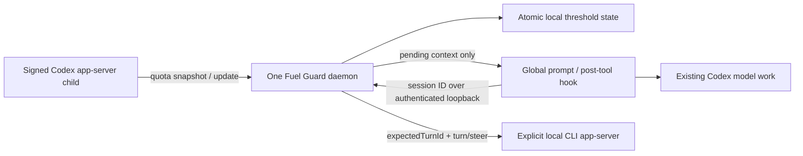

# Architecture and design

## Data path

The daemon uses a persistent stdio Codex child for `account/rateLimits/read`. It listens for `account/rateLimits/updated` and polls every 15 seconds because a separate reader does not necessarily receive usage events produced by another process. These reads call no inference endpoint. Polls are sequential. Reconnection uses the ordinary polling interval and never initiates login or reads credentials.

The IPC server binds only `127.0.0.1` at a deterministic per-installation port in 40000–59999. Bind exclusivity prevents duplicate daemons. Each request also requires a random 256-bit installation token kept in the user's local data directory; it is unrelated to Codex credentials. Requests are bounded, no browser-origin CORS is enabled, and paths/verbs are restricted. Same-user processes are inside the trust boundary. Endpoint collisions fail closed and are diagnosable by foreground `daemon`.

## Deterministic state

`state.json` holds version, hashed account identity, most recent sample time, monotonically increasing local event IDs, per-bucket/duration quota state, and per-session acknowledgments. Writes use a temporary file and rename. The daemon owns quota state; IPC mutations are serialized. Registrations unused for 30 days are pruned.

The multi-bucket map takes precedence over the legacy quota view. Durations identify windows rather than primary/secondary position. Incomplete windows are omitted, not filled with guesses. Full reads mark absent windows unavailable; sparse events preserve other windows until refreshed or stale. The reset timestamp, when available, distinguishes epochs. Old sample timestamps and older reset epochs are rejected. Notifications supersede an outstanding older read using a local sequence number.

No source sequence/timestamp exists in the verified quota payload. Thus a delayed same-epoch backend value without ordering metadata cannot be identified perfectly. Reset timestamps within 60 seconds of the established epoch are treated as clock jitter; live reads varied by one second. Materially older epochs are rejected. Two-sample recovery and hysteresis limit false rearming. This is a telemetry limitation, not an exactly ordered stream claim. A substantial system clock rollback may require reviewing state; do not routinely delete state.

At a downward crossing, all crossed thresholds are marked fired and only the most severe gets a new event. Two readings at threshold + hysteresis rearm that threshold. Reset time advancing before the prior deadline does not itself rearm. The next read after an elapsed reset can rearm even if usage is already low. A changed hashed account clears prior windows and delivery acknowledgments.

## Delivery and failure semantics

Global hooks use Codex-provided `session_id`, `cwd`, and `hook_event_name`. When present, `agent_id` identifies a subagent independently from its parent's session ID. They discard prompts, tool contents, transcript paths, and model output. A fixed installation path in the PowerShell bridge avoids differences in the environment Codex passes to hooks. Hook failures exit successfully without blocking the tool; `doctor` exposes the last bounded health record.

Hooks return compact JSON `hookSpecificOutput.additionalContext` only when a warning is pending. No `Stop`, permission hook, heartbeat, or continuation is installed. A successful hook response acknowledges local delivery before returning; therefore normal duplicates and restarts cannot spam warnings. **There is an unavoidable narrow loss window if the hook/Codex crashes after acknowledgment but before context is consumed.** The hook protocol has no model-consumption acknowledgment. Exactly-once end-to-end delivery is not claimed. The next lower threshold remains independent.

The CLI adapter uses an explicitly registered loopback endpoint. It validates loaded-thread identity, reads metadata and the newest turn without resuming history, and steers only a turn whose status is `inProgress`. `expectedTurnId` protects the idle race. Failed steering retains the warning. Successful RPC acknowledgment persists delivery. An ambiguous transport loss after acceptance may retry and repeat a warning; no new turn is started. CLI steering is covered with a fake WebSocket server, not a real interactive CLI acceptance run in this validation session.

Pending messages expire from eligibility when telemetry exceeds 90 seconds, the window resets, or recovery makes them irrelevant. Idle sessions incur no inference and receive a catch-up warning at their next safe opportunity. Concurrent sessions each receive their own copy; a synthetic test is separately scoped to one exact ID and expires after two minutes.

## Operational boundaries

Native App delivery occurs at supported local tool and user-prompt boundaries, not during uninterrupted internal reasoning or hosted-only tool activity. A 15-second poll plus the time until the next boundary sets practical warning latency. Percentage readings are approximate, and no allowance is reserved for checkpoint work. Configure higher thresholds for unusually rapid consumption.

The daemon keeps one Codex app-server child alive. That process can load installed runtime components; the measured helper is not a zero-memory OS service. Fuel Guard uses the installed Node runtime and signed Codex executable, both of which must remain available. There is no administrator service, automatic binary replacement, model routing, reset-credit code path, or scheduled model heartbeat.
